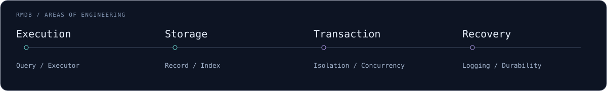
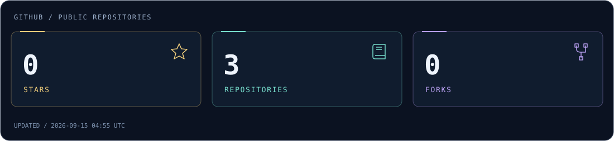

  

  
  
  

  

 

## 🔐 `01 / ENCRYPTED.DATABASE`

  

### 语义安全约束下的密态数据库优化

围绕基于 openGauss 的密态数据库，研究**安全语义、数据访问与查询性能**之间的关系。

- **密态访问** — 索引组织、访问路径与查询执行优化。
- **执行开销** — 加密计算与数据访问带来的性能代价。
- **查询安全** — 查询过程中的信息泄露与语义安全要求。

  
  
  

 

## ⚙️ `02 / RMDB.INTERNALS`

  

### 从存储到执行，深入数据库内核

数据库管理系统设计赛项目 **RMDB**，关注内核实现、正确性与性能优化。

  

- **存储与查询** — 记录管理、索引扫描与执行引擎。
- **事务与恢复** — 并发控制、日志机制与崩溃恢复。
- **性能与验证** — TPC-C 负载、吞吐、尾延迟与回归检查。

  
  
  
  

 

## 🛡️ `03 / SECURITY.PERSPECTIVE`

  

**从密码算法到系统实现，关注数据保护、软件安全与数据库可靠性。**

| 方向 | 关注内容 |
| :--- | :--- |
| **密码与数据保护** | 语义安全 · 密态存储 · 安全查询 |
| **系统与软件安全** | 系统机制 · 逆向分析 · 实现细节 |
| **数据库可靠性** | 事务隔离 · 故障恢复 · 一致性验证 |

 

## 📚 `04 / OPEN.KNOWLEDGE`

  

### [NKU-InformationSecurity ↗](https://github.com/compromise729/NKU-InformationSecurity)

南开大学信息安全**课程课件与学习资料**整理，持续积累笔记、复习材料与实验记录。

  
  
  
  

[浏览仓库 →](https://github.com/compromise729/NKU-InformationSecurity) &nbsp;&nbsp; [资料反馈 →](https://github.com/compromise729/NKU-InformationSecurity/issues)

 

## 🧰 `05 / TOOLCHAIN`

  
  
  
  
  
  
  

 

## ⭐ `06 / REPOSITORY.STATS`

<picture>
  <source media="(max-width: 600px)" srcset="./assets/github-stats-mobile.svg">
  
</picture>

 

## 🐍 `07 / CONTRIBUTION.FLOW`

<picture>
  <source media="(prefers-color-scheme: dark)" srcset="./assets/github-contribution-grid-snake-dark.svg">
  <source media="(prefers-color-scheme: light)" srcset="./assets/github-contribution-grid-snake.svg">
  
</picture>

 

  <b>Secure by design. Fast by measurement.</b> 
  compromise729 &nbsp; / &nbsp; Database Systems × Information Security

